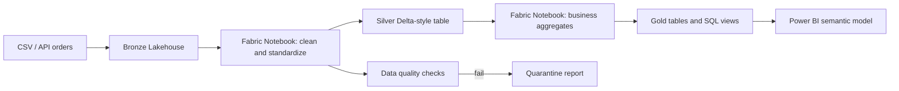

# Microsoft Fabric Retail Lakehouse

A Fabric-ready retail analytics project built around a small, reproducible local dataset. The project demonstrates how a Data Engineer can design a **Bronze/Silver/Gold lakehouse** that maps naturally to Microsoft Fabric while keeping a local fallback for code review and testing.

> **Certification status:** Microsoft Fabric Data Engineer Associate — **DP-700 Candidate / Certification in Progress**. This repository does not claim that the certification has already been earned.

## Why Microsoft Fabric matters

Microsoft Fabric is a SaaS analytics platform that brings data ingestion, data engineering, data science, real-time intelligence, data warehousing, databases, and reporting into one integrated environment. Its shared storage foundation, OneLake, reduces the need to copy data between disconnected workloads. For a Data Engineer, the value is not only learning another cloud service: it is learning how ingestion, lakehouse storage, Spark transformation, orchestration, governance, and BI serving fit into one operating model.

The official Microsoft overview describes Fabric as an end-to-end analytics platform built around integrated workloads and OneLake [1]. The lakehouse combines data-lake scalability with warehouse-style querying [2]. This project translates those ideas into artifacts that can be opened in a Fabric workspace and also tested locally.

## What this project demonstrates

| Capability | Project artifact |
| --- | --- |
| OneLake-oriented layout | `bronze/`, `silver/`, and `gold/` paths under a lakehouse-style workspace |
| Data Engineering | `notebooks/01_bronze_to_silver.py` and `notebooks/02_silver_to_gold.py` |
| Data Factory thinking | `pipelines/retail_daily_pipeline.json` with parameters and activity dependencies |
| Warehouse serving | `sql/gold_views.sql` with business-facing views |
| Data quality | `src/quality.py` and tests for schema, uniqueness, and revenue reconciliation |
| Local reproducibility | `python -m src.pipeline` using DuckDB and Parquet |
| DP-700 preparation | Documentation connects each artifact to ingestion, transformation, orchestration, and serving concepts |

## Architecture



## Local quick start

```bash
python -m venv .venv
source .venv/bin/activate
pip install -e '.[dev]'
python -m src.generate_sample --rows 500
python -m src.pipeline --input data/orders.csv --output-dir data/warehouse
pytest -q -W error
ruff check .
```

The local run creates Parquet outputs and a quality report. No Azure subscription, secret, or paid service is required for the fallback run.

## How to open it in Microsoft Fabric

Create a Fabric workspace and a Lakehouse, then upload the files from `data/` into the Files area. The two Python notebook sources are intentionally written in a notebook-friendly style: copy their cells into Fabric notebooks, replace the local paths with Lakehouse `Files/` and `Tables/` paths, and use Spark DataFrames for Delta tables. The pipeline JSON is a design artifact for mapping the same dependency graph to a Fabric Data Factory pipeline; it is not falsely presented as a deployed tenant export.

A practical Fabric implementation would use a workspace with separate Bronze, Silver, and Gold Lakehouses for stronger ownership and access boundaries. The official medallion guidance is linked in [3].

## Repository layout

```text
src/
  generate_sample.py       # deterministic retail order generator
  pipeline.py              # local Bronze -> Silver -> Gold runner
  quality.py               # executable quality checks
notebooks/
  01_bronze_to_silver.py  # Fabric notebook source
  02_silver_to_gold.py    # Fabric notebook source
sql/
  gold_views.sql           # serving layer views
pipelines/
  retail_daily_pipeline.json
architecture/
  fabric-retail-lakehouse.mmd
tests/
  test_pipeline.py
```

## References

[1] [What is Microsoft Fabric? — Microsoft Learn](https://learn.microsoft.com/en-us/fabric/fundamentals/microsoft-fabric-overview)

[2] [What is a lakehouse? — Microsoft Learn](https://learn.microsoft.com/en-us/fabric/data-engineering/lakehouse-overview)

[3] [Implement medallion lakehouse architecture in OneLake — Microsoft Learn](https://learn.microsoft.com/en-us/fabric/onelake/onelake-medallion-lakehouse-architecture)

[4] [Study guide for Exam DP-700 — Microsoft Learn](https://learn.microsoft.com/en-us/credentials/certifications/resources/study-guides/dp-700)

[5] [Implement data engineering solutions using Microsoft Fabric — Microsoft Learn](https://learn.microsoft.com/en-us/training/courses/dp-700t00)
